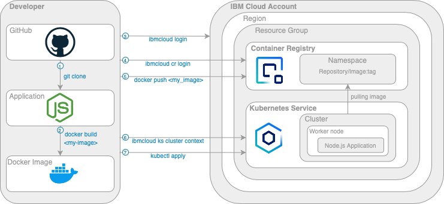

# CZ-IBM-Cloud-Guide

The purpose of this project is to deploy a simple node.js application to Kubernetes on IBM Cloud.



---
## Prerequisities
1. This demo requires UNIX/LINUX based system. However, it is possible to do this also with Windows. Some commands might change. Alternatively you can use the IBM Cloud Shell in browser.
1. If you use Windows, install [git](https://git-scm.com/download/win) 
1. Install [Docker](https://docs.docker.com/get-docker/) of version at least 19.03.13
1. Install [IBM Cloud CLI](https://cloud.ibm.com/docs/cli?topic=cli-getting-started)
1. Install [IBM Cloud CLI](https://cloud.ibm.com/docs/cli?topic=cli-getting-started) plugin for _Kubernetes Service_

    ```
    $ ibmcloud plugin install kubernetes-service
    ```
1. Install [IBM Cloud CLI](https://cloud.ibm.com/docs/cli?topic=cli-getting-started) for _Container Registry_
    ```
    $ ibmcloud plugin install container-registry
    ```
---
## Tutorial
1. Clone the repository

    Open command line and navigate to your preffered folder.

    Examle:
    ```
    $  cd Desktop/MyProjects
    ```
    Clone this repository:

    ```
    $  git clone https://github.ibm.com/IBM-Cloud-Guide/Kubernetes.git
    ```
1. Create IBM Cloud account [here](https://cloud.ibm.com/registration)
1. Login to your IBM Cloud account [here](https://cloud.ibm.com/login)
1. Create `Kubernetes Service` in IBM Cloud [here](https://cloud.ibm.com/kubernetes/catalog/create)
    1. As `Pricing plan` choose `Free`
    1. Optionally change `Cluster name` and `Resource group`
    1. Click `Create`
1. Create `namespace` in `Container Registry` [here](https://cloud.ibm.com/registry/namespaces)
    1. Optionally change `Resource group`
    1. Paste `Name` 
    1. Click `Create`
1. Login to IBM Cloud
     ```
    $ ibmcloud login -sso 
    ```
    Output:
    >Paste `y` to get one time password in browser and then copy and paste the one time password.
    ```
    API endpoint: https://cloud.ibm.com
    Region: eu-de

    Get a one-time code from https://identity-2.uk-south.iam.cloud.ibm.com/identity/passcode to proceed.
    Open the URL in the default browser? [Y/n] > 
    ``` 
    
1. Login to Container Registry
    ```
    $ ibmcloud cr login
    ```
    Output:
    
    ```
    Logging in to 'registry.eu-de.bluemix.net'...
    Logged in to 'registry.eu-de.bluemix.net'.
    Logging in to 'de.icr.io'...
    Logged in to 'de.icr.io'.

    OK
    ``` 
1. Get your Kubernetes cluster context

    ```
    $ ibmcloud ks cluster config --cluster <cluster_id>
    ```
    >Cluster ID can be found in IBM Cloud Kubernetes console

    Output:
    
    ```
    Logging in to 'registry.eu-de.bluemix.net'...
    Logged in to 'registry.eu-de.bluemix.net'.
    Logging in to 'de.icr.io'...
    Logged in to 'de.icr.io'.

    OK
    ``` 

1. Create Docker Image
    
    Navigate to the root of this project. To make sure you are in the root paste the following command:

    For MacOs/Linux
     ```
    $ ls 
    ```

    For Windows:
      ```
    $ cd
    ```

    Output:
    ```
    Dockerfile      
    README.md       
    app             
    deployment.yml
    ```
    To create docker image, run the following command:
     ```
    $ docker build -t <provider>/<my_namespace>/<my_repo>:<my_tag> .
    ```
    >The `<provider>` is a name of the image registry provider. Depending on your provider choose the correct name. In our case it would be `de.icr.io`. The `<my_namespace>` is the namespace you have created in Container Registry. `<my_repo>` will be created automatically. `<my_tag>` is the name of your image and you can optionally add version.

    >To make sure your tag (`<provider>/<my_namespace>/<my_repo>:<my_tag>`) is correct, got to IBM Cloud web console -> Container Registry -> Images -> Create.
    

    The tag is now visible by running this command:
     ```
    $ docker image ls
    ```

1. Push Docker Image to your Container Registry

    ```
    $ docker push <provider>/<my_namespace>/<my_repo>:<my_tag>
    ```
    
1. Update the image tag (name) in `deployment.yml` file instead of `*`
    ```
    spec:
      containers:
        - name: nodejs
          image: *
          imagePullPolicy: Always
          ports:
            - containerPort: 3000
    ```

1. Deploy the application tu Kubernetes cluster
    >The file `deployment.yml` in the root of the project contains a script, which processes the deployment automatically. The objective is to apply this deployment template.
    ```
    $ kubectl apply -f deployment.yml
    ```
    
1. Navigate to your `Kubernetes cluster` in IBM Cloud, click on `Worker nodes` and copy the `Public IP`. 

    Paste the IP adress to your browser and add nodePort `30080`.
    >The port can be changed in `deployment.yml` file.

    Example:
    ```
    http://159.122.177.240:30080
    ```
    Congratulations! Now you are able to see the application in browser!


